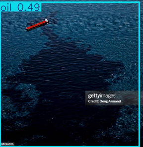
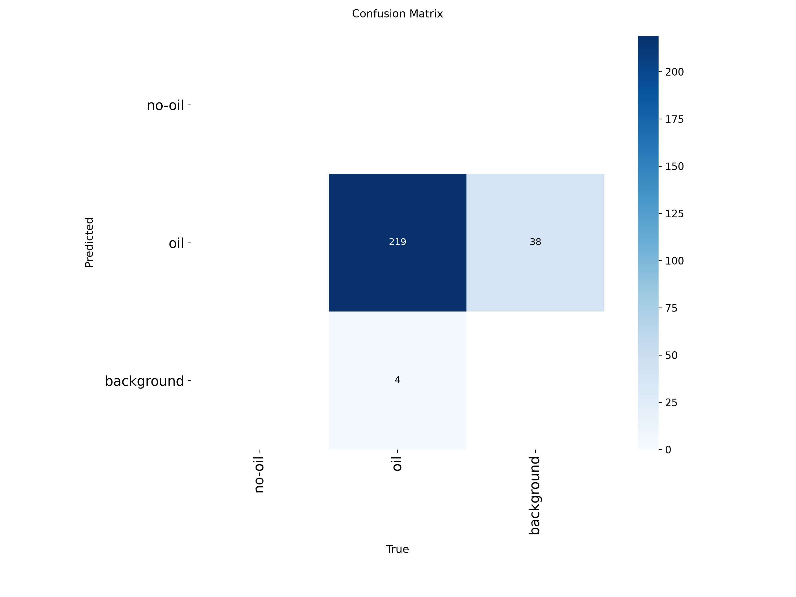
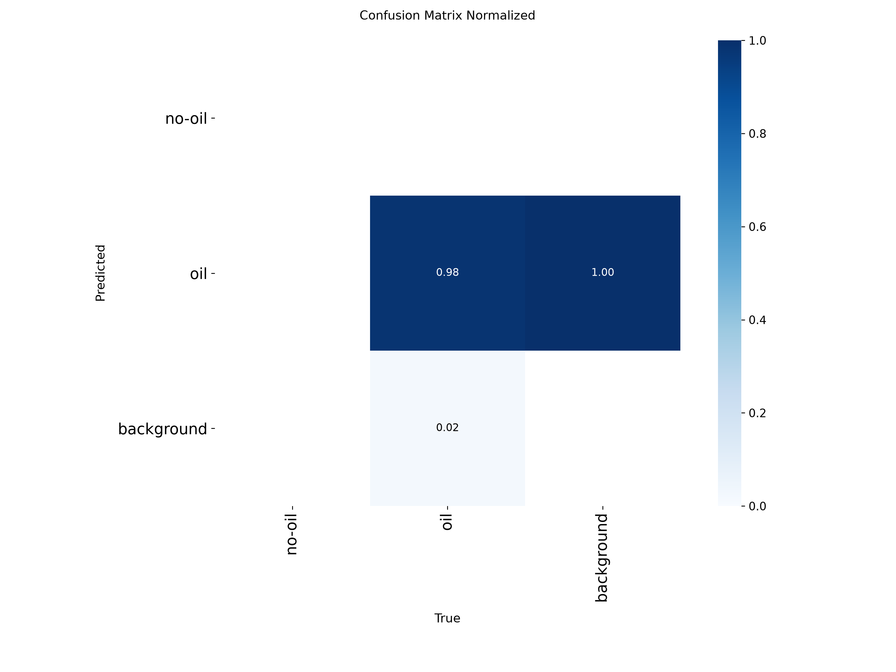

# Oil Spill Detection


Object detection model that identifies oil spills in images using YOLOv11, trained on the [oil-detection-2](https://universe.roboflow.com/yolo-m1lny/oil-detection-2) dataset from Roboflow Universe.

<table>
  <tr>
    <td></td>
    <td></td>
  </tr>
</table>

## Overview

This project fine-tunes a YOLOv11 model to classify and localize oil spills, distinguishing between `oil` and `no-oil` regions in an image. It includes training, inference, and a simple Flask web interface for testing the model on new images.

## Classes

- `oil`
- `no-oil`

## Dataset

- **Source:** [oil-detection-2 on Roboflow Universe](https://universe.roboflow.com/yolo-m1lny/oil-detection-2)
- **Size:** 2,691 images
- **Format:** YOLOv11

### Class Distribution & Label Analysis

The dataset is heavily imbalanced toward the `oil` class (2,794 instances vs. 96 for `no-oil`), and bounding boxes cluster around the image center with a strong bias toward full-width/full-height boxes.


This imbalance is the main thing to keep in mind when interpreting results below — the model has seen far more `oil` examples than `no-oil` ones.

## Training Configuration

| Parameter | Value |
|---|---|
| Model | YOLOv11 |
| Epochs | 100 |
| Patience | 50 |
| Image size | 640 |

## Results

Validation metrics after training:

| Metric | Score |
|---|---|
| mAP50-95 | 0.7838 |
| mAP50 | 0.9810 |
| mAP75 | 0.8525 |
| Mean Precision | 0.9577 |
| Mean Recall | 0.9013 |

### Confusion Matrix

<table>
  <tr>
    <td></td>
    <td></td>
  </tr>
</table>

The model correctly predicts `oil` 219 times with 4 missed detections (predicted background instead), and 38 background regions are incorrectly flagged as `oil`. Note that **no `no-oil` predictions appear in the matrix at all** — with only 96 training instances for that class against 2,794 for `oil`, the model has effectively not learned to distinguish it. This is the clearest actionable finding from this run.

## Known Limitations

- **Severe class imbalance** — `no-oil` is underrepresented ~29:1 against `oil`, and the confusion matrix confirms the model doesn't reliably predict it.
- **False positive rate on background** — 38 background regions are misclassified as `oil`, which matters in a real deployment where false alarms have a cost.
- **Single dataset source** — all training data comes from one Roboflow collection; generalization to other sensors, lighting, or water conditions (satellite vs. surface imagery, different oil types) is untested.
- **No temporal/video handling** — the model treats each frame independently; no tracking or temporal smoothing across video streams.

## Future Scope

- **Rebalance the dataset** — collect or augment more `no-oil` examples (oversampling, targeted scraping, or synthetic augmentation) to fix the class skew shown in the label distribution above.
- **Class-weighted loss / focal loss** — mitigate imbalance at the training level rather than only at the data level.
- **Expand to segmentation** — move from bounding boxes to instance/semantic segmentation for more precise spill boundary estimation, which matters more for area/volume estimation than detection alone.
- **Multi-source validation** — test against satellite (SAR/optical) imagery in addition to surface-level photos to check generalization.
- **Video/stream inference** — extend `detect.py`/the Flask app to handle video feeds with frame-to-frame tracking for continuous monitoring (e.g. drone or CCTV feeds).
- **Edge deployment** — export to ONNX/TensorRT and benchmark on edge hardware (e.g. Raspberry Pi, Jetson) for field-deployable monitoring buoys or drones.
- **Confidence calibration** — analyze whether reported confidence scores are well-calibrated, especially given the false-positive rate on background regions.
- **Active learning loop** — feed misclassified web-app uploads back into a retraining pipeline to progressively improve `no-oil` recall.

## Project Structure

```
.
├── train.py             # Flask web app — upload an image, run detection, view results
├── static/
│   ├── uploads/          # Uploaded images
│   └── results/          # Annotated output images
└── weights/
    └── best.pt            # Trained model weights
```

## Usage

### Run the web app

```bash
python app.py
```

Then open `http://localhost:5000` in your browser, upload an image, and view the detection results with confidence scores.

## Requirements

```bash
pip install ultralytics roboflow flask opencv-python
```
